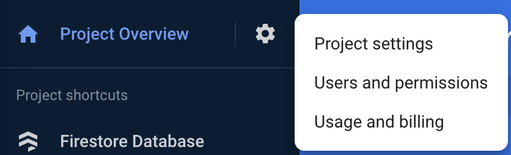

# Read and write from Firebase!
## Goal
Switch from your canned list of channels to reading/ writing them from Firebase.
## Start at fork:
`exercise-3-start`
## Tasks
1. Create a Firebase project
2. Connect Firebase to app in unsecured mode
3. Read channels from Firebase into MST store
4. Wire up Add Channel to Firebase
## Useful info
- [Structuring data with Firebase](https://firebase.google.com/docs/database/web/structure-data)
- [Using Firebase with Expo- JS vs Native SDK](https://docs.expo.dev/guides/using-firebase/#using-firebase-js-sdk)
- [MST Lifecycle functions](https://mobx-state-tree.js.org/overview/hooks)

## Since you've been gone
- We added the chat screen, but just because we could and it looks fun. We don't need it yet.

## How to do it

### 1. Setup Firebase
This will be done in the [Firebase Console](https://console.firebase.google.com/). You may have done some of these steps when fulfilling the prereqs; if so, skip ahead down the list.
a) Create the Firebase project, accept the defualts.


b) In Firebase Console, go to Settings, scroll to bottom, and add a Web App. Check the "Firebase hosting" option (we'll use it later).



c) Copy the project ID's, etc from the wizard into **initFirebase.js**.
d) Back in Firebase dashboard, go to Build, then Firestore, then Create Database

e) Start the database in "Test Mode", and otherwise accept the defaults
f) Add a test collection and first record:
  collection name: "channel"
  fields:
    - name (string)
  give it an auto ID.

### 2. Start reading in your MST model
#### a. Get data flowing in your stores
In `ChannelStore`, we will update it to subscribe to Firebase, updating `channels` as Firebase updates.
- [ ] You'll need some new imports:
```ts
import {
  collection,
  query,
  onSnapshot,
  getFirestore,
  addDoc,
} from "firebase/firestore";
```

- [ ] Hook into MST lifecycle functions to subscribe to the collection on startup. Change your `actions` block to look like this:
  ```ts
  .actions((self) => {
    let unsubscribeFromFirebaseStream;
    function afterAttach() {
      const db = getFirestore();
      const q = query(collection(db, "channels"));
      unsubscribeFromFirebaseStream = onSnapshot(q, (querySnapshot) => {
        self.updateChannels(querySnapshot);
      });
    }

    function beforeDestroy() {
      unsubscribeFromFirebaseStream && unsubscribeFromFirebaseStream();
    }

    function addChannel(name: string) {
      self.channels.push({ name, id: self.channels.length.toString() })
    }

    return {
      afterAttach,
      beforeDestroy,
      addChannel,
    }
  })
  ```

Notice we're changing the function body from returning an object directly to including procedural code.

- [ ] Add a separate `actions` block above the existing one:
```ts
 .actions((self) => ({
    updateChannels(querySnapshot) {
      self.channels.clear();
      querySnapshot.forEach((doc) => {
        self.channels.push({ id: doc.id, name: doc.data().name });
      });
    }
  }))
  ```
This is in a separate block due to a TypeScript/ MST limitation: https://mobx-state-tree.js.org/tips/typescript#typing-self-in-actions-and-views

We enclose `updateChannels` in a separate action because MobX observers will not know to trigger an update based on the snapshot callback unless the updating code is in a MobX Action.

#### b. Tweak the data flow to show things in alphabetical order

- [ ] One more time in `ChannelStore`, add a `views` block to your model to make a nice view for reading the list in order:
```ts
.views((self) => ({
    get channelsForList() {
      return sortBy(self.channels.slice(), c => c.name.toLowerCase());
    },
  }))
```

(don't forget the corresponding import from `lodash`)

- [ ] Update `ChannelListScreen` to have the `FlatList` read from the new view prop:
```data={channelStore.channelsForList}```

🏃**Try it!** Add a channel directly in the Firestore console, it should show up in the Channels list. That's what subscriptions do!

### 3. Wire up adding a channel
- [ ] Update `addChannel` as such:
```ts
const addChannel = flow(function* addChannel(name) {
  const db = getFirestore();
  // add new document with auto-id
  yield addDoc(collection(db, "channels"), {
    name
  });
});
```
MST uses generator functions much in the way you'd use `async`/ `await`, but this has the advantage of hooking into MST lifecycle features. If you had to, you could use middleware to plug in code before or after an action awaits, or if it errors out (this is super-useful for Sentry error logging).

Oh, and you'll need to import `flow` from `mobx-state-tree`.

🏃**Try it!** You should be able to add a channel, and it shows up right away on your screen and in Firestore.

### Fixing weird errors
You can get rid of the cyclic JSON structure error by going to **useStores.ts** and commenting out `setReactotronRootStore(rootStore, restoredState)`. Technically, we don't really need async storage anymore, since Firebase should handle offline support, so we could remove more code here... but it doesn't hurt anything at the moment.

