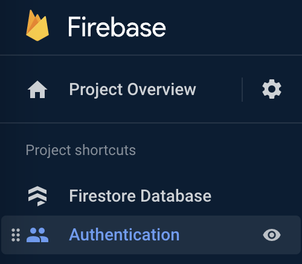

# Authenticate with Firebase!
## Goal
Make the login screen actually work, using Firebase email/ password authentication. We're going to ignore sign-up workflow for now. Suffice to say, it would basically involve collecting an initial email and password on a diffent screen.
## Start at fork:
`exercise-4-start`
## Tasks
1. Set up email/ password auth in Firebase
2. Create an account inside the console for testing
3. Wire-up `AuthenticationStore` to Firebase
4. Rework the Login screen logic to work with the store updates.
5. Add basic "must be authenticated" security to the security rules (turn off test mode).
## Useful info
- [Firebase authentication methods](https://firebase.google.com/docs/auth)
- [Firebase email/ password auth](https://firebase.google.com/docs/auth/web/password-auth)

## How to do it
### 1. Setup email/password auth in Firebase Console
a) In Firebase console, go to Build -> Authentication

b) Select email/ password login method
c) UNSELECT "email link" (I actually love this method and think we all should use it long-term, but it's out of scope for today)
d) Save

#### a. Create a test user
a) Inside the Authentication dashboard still, go to Users.
b) Create a new user that you will use to test.
TIP: Use gmail aliases, e.g., youremail+fernichat1@gmail.com. Then you can create multiple accounts.

### 2. Wire up AuthenticationStore
We're going to modify `AuthenticationStore` significantly. It's just easier this way. We want to keep email/ password as ephemeral form-only state, and save the `user` object to indicate if the user is logged in.

- [ ] New imports:
```ts
import { getAuth, signInWithEmailAndPassword, onAuthStateChanged, signOut } from "firebase/auth"
```

- [ ] New props and views (replace the old ones):
```ts
.props({
    user: types.frozen(),
    loginError: types.maybe(types.string),
    isLoading: false,
  })
  .views((self) => ({
    get isAuthenticated() {
      return !!self.user
    },
  }))
```

The "frozen" type is just kind of like `any` - it could be whatever. We could figure out the exact type of the Firebase object, or we could store a subset of it, but maybe another day.

- [ ] New first actions block:
```ts
.actions((self) => {
  const login = flow(function* login({ email, password }) {
    const auth = getAuth()
    try {
      self.isLoading = true
      self.loginError = undefined
      yield signInWithEmailAndPassword(auth, email, password)
    } catch (error) {
      self.loginError = error.message
    } finally {
      self.isLoading = false
    }
  })

  const logout = flow(function* logout() {
    const auth = getAuth()
    try {
      yield signOut(auth)
      self.user = undefined
      self.loginError = undefined
    } catch (error) {
      // eh?
    }
  })

  return {
    logout,
    login,
  }
})
  ```

  Remember to import `flow` from `mobx-state-tree`.

  - [ ] Finally, add a second action block to setup a listener for auth state change:
  ```ts
  .actions((self) => {
    function afterCreate() {
      const auth = getAuth()
      onAuthStateChanged(auth, (user) => {
        if (user) {
          self.setProp('user', user)
        } else {
          self.logout()
        }
      })
    }

    return {
      afterCreate,
    }
  })
  ```

  `setProp` comes from the `withSetPropAction` utility. It wraps prop setters in actions so they can be called safely (aka, MobX will pick up changes) from other actions, including callbacks.

### 3. Wire up login screen
Since the old `AuthenticationStore.setAuthEmail` is gone, we need to clean up local state to support all form fields.

#### a. OMG hooks!
- [ ] In `LoginScreen` setup local state like this:
```ts
const [authEmail, setAuthEmail] = useState("")
const [authPassword, setAuthPassword] = useState("")
const [isAuthPasswordHidden, setIsAuthPasswordHidden] = useState(true)
```
(you can get rid of `isSubmitted`, `attemptsCount` state)

- [ ] Pull in your stores functionality as another hook:
```ts
const {
    authenticationStore: { login, loginError, isLoading },
  } = useStores()
```

- [ ] Get rid of the first `useEffect()` so it doesn't default in an email and password. Also, get rid of the second `useEffect()` hook!

#### b. Fix that form!
- [ ] Make a new `onPressLogin` callback that sends the email and password to the store's login method:
```ts
const onPressLogin = useCallback(() => {
    login({ email: authEmail, password: authPassword })
  }, [authEmail, authPassword])
```

(import `useCallback` from `react`)

- [ ] Set the events that used the `login` function to use `onPressLogin` instead (two locations- both the button and when pressing enter from the password text bocx)

- [ ] Replace `error` references with `loginError`. This won't make the prettiest error messages, but it will do for now.

🏃**Try it!** You should be able to login now.

### 4. OMG why isn't the auth state persisting?
Hooboy, Firebase team really throws you for a loop. It turns out that the default auth persistence provider is in-memory, so you get logged out whenever you reload! You can override it to a local storage provider... which doesn't work with React Native 71 :-/

- [ ] So, jam this code into App.js, right after the Firebase init. Probably good to refactor this into a different file if you're doing the real thing.

```ts
// Initialize Firebase
const app = initializeApp(firebaseConfig);

const reactNativeLocalPersistence =
  getReactNativePersistence({
    getItem(...args) {
      // Called inline to avoid deprecation warnings on startup.
      return AsyncStorage.getItem(...args);
    },
    setItem(...args) {
      // Called inline to avoid deprecation warnings on startup.
      return AsyncStorage.setItem(...args);
    },
    removeItem(...args) {
      // Called inline to avoid deprecation warnings on startup.
      return AsyncStorage.removeItem(...args);
    },
  });

initializeAuth(app,
  {
    persistence: reactNativeLocalPersistence
  }
)
```

- [ ] New imports:
```ts
import AsyncStorage from '@react-native-async-storage/async-storage';
import { initializeAuth, getReactNativePersistence } from "firebase/auth"
```

🏃**Try it!** You should be able to login now and stay logged in even after a full refresh.

### 5. Add security rules
- [ ] Update your security rules in the Firebase Console (Firestore -> Rules) as such:
```
rules_version = '2'
service cloud.firestore {
  match /databases/{database}/documents {
    match /{document=**} {
      allow read, write: if request.auth != null
    }
  }
}
```

Now, you HAVE to login to use the app.

### Bonus: Add a loading spinner to the login screen

In `LoginScreen`, add an `isLoading` prop set to `isLoading` from the auth store, like this:
```diff
<Screen
  preset="auto"
  contentContainerStyle={$screenContentContainer}
  safeAreaEdges={["top", "bottom"]}
++isLoading={isLoading}
>
```

It doesn't work yet, let's fix that.

In **components/Screen.tsx**, add an `isLoading` boolean prop to `BaseScreenProps`.

Then, in the `Screen` component, add the conditional overlay just under `KeyboardAvoidingView`:
```diff
</KeyboardAvoidingView>
++ {isLoading ? (
++  <View style={$spinnerContainerStyle}>
++    <ActivityIndicator size="large" />
++  </View>
++ ) : null}
</View>
```

Update props and imports accordingly.
